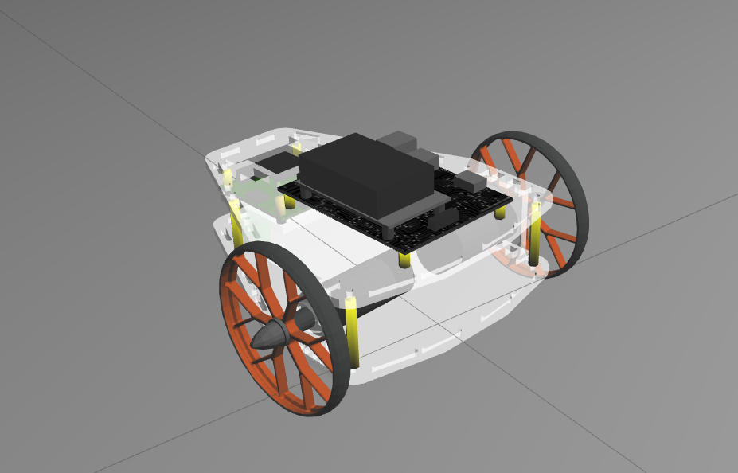

# Puzzlebot Core

This repository includes the description and bringup packages for the **Puzzlebot** from Manchester Robotics. It is important to emphasize that this project only contains the setup for a simulation environment. It is highly recommended to treat these packages as a module/repo since they are included in multiple projects.



---

## Prerequisites
- **ROS 2:** Humble  
- **Simulator:** Gazebo Classic  

---

## Installation
Installing this package is quite simple. You only need to clone this repository into your workspace and check the corresponding ROS dependencies:

```sh
# Go to your workspace src folder
cd ~/ros2_ws/src

# Clone the repository
git clone [https://github.com/GGSVic/puzzlebot_core.git](https://github.com/GGSVic/puzzlebot_core.git) puzzlebot

# Install dependencies and build
cd ..
rosdep install --from-paths src --ignore-src -r -y
colcon build --packages-select puzzlebot_gazebo puzzlebot_bringup
```
---
### How to use

The bringup package includes two launch files: `rviz2.launch.py` and `state_publisher.launch.py`. You need to run both of them to visualize the model properly in your ROS 2 environment. Of course, you have to source your workspace, which will allow you to set an important environment variable in your system: PUZZLEBOT_MODEL.

You can change between three types of models:

- `drive`: The simplest version. It includes a basic chassis and the corresponding wheels and plugins to move the robot.

- `vision`: Expands the drive model by adding a functional camera.

- `perception`: Includes both the camera and a LiDAR sensor for more advanced projects.

Depending on the model you want to use, you will need to set the variable properly (set as drive by default):

#### Terminal 1: 
``` sh
source install/setup.bash
export PUZZLEBOT_MODEL=drive # Options: drive, vision, perception
ros2 launch puzzlebot_bringup state_publisher.launch.py
```

#### Terminal 2: 
``` sh
source install/setup.bash
ros2 launch puzzlebot_bringup rviz2.launch.py
```

---
## Credits
The robot is provided my [Manchester Robotics]( https://github.com/ManchesterRoboticsLtd) and the used meshes were originally extracted from its repository [puzzlebot_ros](https://github.com/ManchesterRoboticsLtd/puzzlebot_ros.git).

---
## License

Apache-2.0