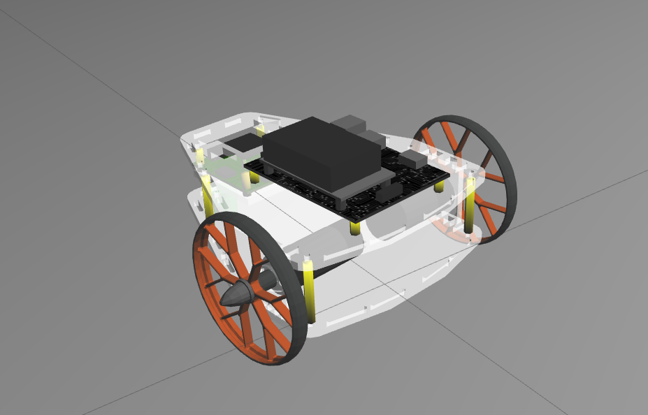

# Puzzlebot Core

This repository includes the description and bringup packages for the **Puzzlebot** from Manchester Robotics. It is important to emphasize that this project only contains the setup for a simulation environment. It is highly recommended to treat these packages as a module/repo since they are included in multiple projects.



---

## Prerequisites
- **ROS 2:** Humble  
- **Simulator:** Gazebo Sim  

---

## Installation
Installing this package is quite simple. You only need to clone this repository into your workspace and check the corresponding ROS dependencies:

```sh
# Go to your workspace src folder
cd ~/ros2_ws/src

# Clone the repository
git clone -b gz-sim https://github.com/GGSVic/puzzlebot_core.git ros_gz_puzzlebot
# Install dependencies and build
cd ../
rosdep install --from-paths src --ignore-src -r -y
colcon build --packages-select ros_gz_puzzlebot_description ros_gz_puzzlebot_bringup
```
---
### How to use

The bringup package includes three launch files: 

* `state_publisher.launch.py`:  Launches the ***robot_state_publisher*** node with the urdf file as an argument and its corresponding ***RVIZ*** visualization. 
* `spawn_puzzlebot.launch.py`: Reusable launch file that allows the user to spawn a puzzlebot within a Gazebo world simulation using the ***spawn_entity.py*** node. 
* `minimal_simulation.launch.py`: Designed to test that everything is set up correctly. It launches an empty world and includes the launch files already described. 

After sourcing the workspace where the packages are located, an important environment variable will appear in your system: ***PUZZLEBOT_MODEL***. You can change between three types of models:

- `drive`: The simplest version. It includes a basic chassis and the corresponding wheels and plugins to move the robot (**default**).

- `vision`: Expands the drive model by adding a functional camera.

- `perception`: Includes both the camera and a LiDAR sensor for more advanced projects.

#### Update: You can now use also a forklift as part of the model. Follow the instructions below to enable it. 

Once the workspace is sourced, the variable ***INCLUDE_FORKLIFT*** will appear in your system. You can set it to `false` or `true`. The variable is set to `true` by default. 


Depending on the model you want to use, you will need to set the variable properly (set as drive by default):

``` sh
# Go to your workspace src folder
cd ~/ros2_ws
# Source the workspace
source install/setup.bash
export PUZZLEBOT_MODEL=drive # Options: drive, vision, perception
ros2 launch ros_gz_puzzlebot_bringup minimal_simulation.launch.py
```
---
### Forklift Support

The Puzzlebot can optionally be equipped with a two-stage forklift attachment. After sourcing the workspace, the environment variable ***INCLUDE_FORKLIFT*** becomes available. You can choose between the following options:  

- `true`: Spawn the robot with the forklift attachment.

- `false`: Spawn the robot without the forklift.

The forklift can be used with any available Puzzlebot model (drive, vision, or perception).

**Note**:  The forklift attachment is currently available only in the Gazebo Sim (gz-sim) branch. The model was designed to provide a simple forklift-like mechanism for simulation and demonstration purposes. It is not intended to be a mechanically accurate representation of a real forklift, and therefore should not be used as a reference for mechanical design or dynamic analysis.

---
### Forklift Control

The forklift is composed of two independently controlled stages:

1. Inner mast position.
2. Fork carriage position.

Commands are sent through:

```sh
ros2 topic pub --once /forklift_controller/commands std_msgs/msg/Float64MultiArray "{data: [0.06, 0.08]}"
```

Where:

```text
data[0] -> Inner mast position (m)
data[1] -> Fork carriage position (m)
```

#### Important Note

The joint limits defined in the URDF are intentionally larger than the intended operating range of the mechanism. This is a workaround for a known Gazebo issue that may cause prismatic joints to become unresponsive when operating close to their declared limits.

For this reason, users should avoid commanding positions near the URDF limits and instead operate the forklift within the following recommended ranges:

```text
Inner mast:     0.00 m - 0.06 m
Fork carriage:  0.00 m - 0.08 m
```

These ranges correspond to the intended motion of the mechanism and help maintain both visual consistency and reliable simulation behavior.

---
## Credits
The robot is provided by [Manchester Robotics]( https://github.com/ManchesterRoboticsLtd), and the used meshes were originally extracted from its repository [puzzlebot_ros](https://github.com/ManchesterRoboticsLtd/puzzlebot_ros.git).

---
## License

Apache-2.0
